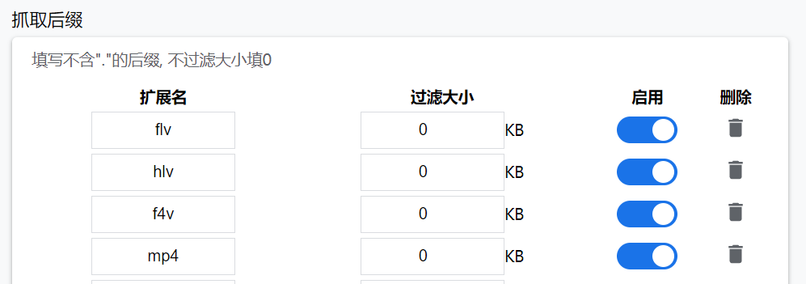
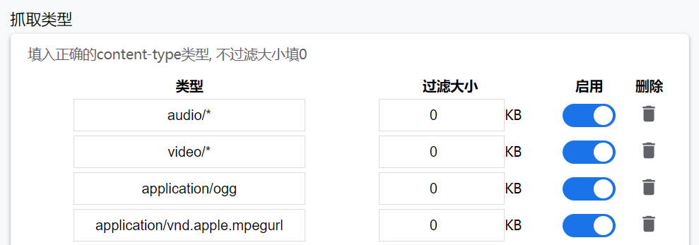
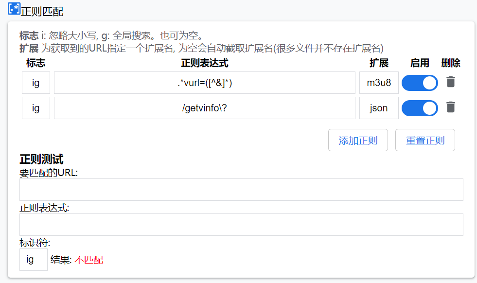
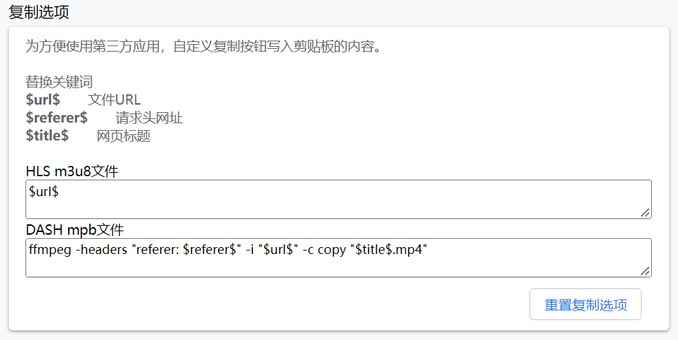
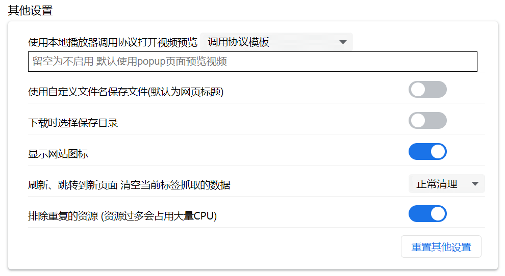

# 设置

## **扩展和类型匹配规则**

浏览器接收到文件时判断





## **正则匹配**

浏览器准备打开这个URL之前就对这个URL进行正则匹配。所以优先级最高。



**扩展** 猫抓无法知道正则匹配的资源类型，需要指定一个扩展名，留空会尝试截取网址的后缀名，由于许多网址没有后缀所以可能最终无法知晓类型，无法在popup页面显示相应的解析器入口或播放图标。

正则匹配有两种匹配模式:

**提取url** 使用括号，可以只提取括号内的网址 (如上图第一个示例。)

**常规匹配** 判断URL是否匹配。(如上图第二个示例。)

## 复制选项

方便使用第三方工具，点击popup页面复制按钮，直接复制你想要的字符串。



### URL Protocol m3u8dl

<figure><figcaption></figcaption></figure>

具体查看[m3u8dl.md](m3u8dl.md "mention")

## 替换标签

<figure><figcaption></figcaption></figure>

### 自定义保存文件名

需打开 **其他设置** 里 `使用自定义文件名保存文件` 选项。可以创建目录 例`${title}/${fullFileName}` 最后储存在 以 title 创建的文件夹内。

## 替换关键词(2.3.1+) <a href="#keywords" id="keywords"></a>

用于 复制选项 N\_m3u8DL-CLI 保存文件名 等 使用的关键词替换。标签区分大小写。

<table><thead><tr><th width="211">标签</th><th width="275">说明</th><th>结果 示例</th></tr></thead><tbody><tr><td><strong>${url}</strong></td><td>资源地址</td><td>https://bmmmd.com/test.mp4</td></tr><tr><td><strong>${referer}</strong></td><td>资源请求头<br>如果资源不存在referer不输出内容, 建议配合exists函数</td><td>https://bmmmd.com/</td></tr><tr><td><strong>${initiator}</strong></td><td>类似于永远有值的 ${referer}<br>如果资源不存在referer则使用来源网址域名或当前页面网址。</td><td>https://bmmmd.com</td></tr><tr><td><strong>${webUrl}</strong></td><td>资源播放页面地址</td><td>https://bmmmd.com/test.html</td></tr><tr><td><strong>${title}</strong></td><td>资源播放页面的标题</td><td>测试视频</td></tr><tr><td><strong>${fullFileName}</strong></td><td>完整文件名</td><td>test.mp4</td></tr><tr><td><strong>${fileName}</strong></td><td>文件名，不包含扩展</td><td>test</td></tr><tr><td><strong>${ext}</strong></td><td>扩展名，不包含"."</td><td>mp4</td></tr><tr><td><strong>${userAgent}</strong></td><td>User Agent 自定义在设置 - 替换标签 修改</td><td>Mozilla/5.0 (Windows NT 10.0; Win64; x64) AppleWebKit/537.36 (KHTML, like Gecko) Chrome/108.0.0.0 Safari/537.36</td></tr><tr><td><strong>${cookie}</strong></td><td>资源所需的cookie <strong>有可能为空</strong><br>格式为 key=value;key=value;<br>需要猫抓 2.3.8版本</td><td>key=value;key2=value2;</td></tr><tr><td><strong>${mobileUserAgent}</strong></td><td>同样也是模拟手机时用的User Agent</td><td></td></tr><tr><td><p>${year}</p><p>${month}</p><p>${date}<br>${hours}<br>${minutes}<br>${seconds}</p></td><td>时间相关，年/月/日/时/分/秒</td><td>*</td></tr><tr><td>${day}</td><td>星期几(英文)</td><td>Sunday, Monday, Tuesday, Wednesday, Thursday, Friday, Saturday</td></tr><tr><td><strong>${now}</strong></td><td>unix 时间戳</td><td>1672329448871</td></tr><tr><td><strong>${fullDate}</strong></td><td>日期</td><td>2020-12-28</td></tr><tr><td><strong>${time}</strong></td><td>时间</td><td>21'30'55</td></tr><tr><td>${shareApi}</td><td>系统分享API 只允许在 <a data-mention href="settings.md#player-protocol">#player-protocol</a></td><td></td></tr></tbody></table>

### 函数支持

以上列表标粗的标签可以使用函数

<table><thead><tr><th width="123.33333333333331">函数</th><th width="188">说明</th><th>示例</th></tr></thead><tbody><tr><td>slice</td><td>字符截取</td><td><p><code>${title|slice:0,5}</code><br>提取标题前5个字符</p><p><br><code>${title|slice:-10}</code><br>提取标题末尾10个字符<br><br>参数设定来自 js语言 slice 函数</p></td></tr><tr><td>replace</td><td>字符替换</td><td><code>${fullFileName|replace:".m3u8",".mp4"}</code><br>文件名中的".m3u8"字符替换成".mp4"<br><br><code>${title|replace:"网站",""}</code><br>删除标题中 网址 一词<br><br>参数设定来自 js语言 replace 函数</td></tr><tr><td>replaceAll</td><td>字符替换</td><td>同上<br>replace 只替换一次。replaceAll 多次替换。<br><br><code>${fullDate|replaceAll:"-","/"}</code><br>2020/12/28<br>把日期的分隔符换成 "/"</td></tr><tr><td>regexp</td><td>正则提取</td><td><code>${url|regexp:"(https?://[^?]*)"}</code><br>资源地址，提取不包含参数的地址</td></tr><tr><td>exists</td><td><p>如果存在则输出</p><p>反之输出第二个参数，没有第二参数，不输出任何内容。</p></td><td><p><code>${referer|exists:'--headers "Referer:*"'}</code><br>如果存在referer 则输出 --headers "Referer:*"<br>*号最终会被替换成referer本身。</p><p><em>建议填写在m3u8DL参数内，如果存在referer向m3u8DL传递<code>--headers</code>参数，如果没有则不传递。</em></p><p><br><code>${fullFileName|exists:"*","${title}"}</code><br>如果有文件名输出自己，没有文件名输出网页标题。</p></td></tr><tr><td>to</td><td><p>字符串转换<br>base64<br>urlEncode</p><p>urlDecode<br>lowerCase<br>upperCase</p></td><td><p><code>${title|to:base64}</code></p><p>5rWL6K+V6KeG6aKR</p><p>base64编码<br><br><code>${url|to:urlEncode}</code><br>https%3A%2F%2Fbmmmd.com%2Ftest.m3u8<br>url编码<br><br><code>${url|to:lowerCase}</code> 英文字母转小写<br><code>${url|to:upperCase}</code> 英文字母转大写</p></td></tr></tbody></table>

支持链式调用，例如&#x20;

`${url|regexp:"(https?://[^?]*)"|replace:"http://","https://"|to:base64}`

将从左到右依次对url进行，提取 替换 转换base64操作。

## 其他设置



### 始终不启用猫抓下载器

下载文件时，检测到资源服务器拒绝下载会重新打开猫抓下载器携带referer参数重新下载文件。如果你使用第三方下载软件打开该选项禁止猫抓下载器被调用。

### 使用本地播放器调用协议打开视频预览 <a href="#player-protocol" id="player-protocol"></a>

部分本地播放器有调用协议，如PotPlayer 有 `potplayer://` 猫抓就能使用该协议直接调用potplayer去播放抓取的资源。

支持替换标签

右侧 `调用协议模板` 下拉菜单有常用的播放器协议。只有部分安卓浏览器支持`intent:`协议调用，所以手机用户更建议使用 `系统分享` 模式。

不使用调用协议 删除清空即可。


系统分享模式对浏览器版本有需求。

具体查看[https://caniuse.com/mdn-api\_navigator\_share](https://caniuse.com/mdn-api\_navigator\_share)


### **m3u8dl://协议调用**

具体查看教程[m3u8dl.md](m3u8dl.md "mention")

### 刷新、跳转到新页面 清空当前标签抓取的数据

分为 不清空 正常清理 频繁清理。

其中 频繁清理 比较敏感，比如视频网站，点击观看下一个视频时会先清空。

正常清理 严格按照 是否用户主动刷新，主动点击新链接到新页面，以上动作才会触发清空。

频繁清理可能会导致部分网站在嗅探到资源后立刻被清理，遇到嗅探不到资源的网站，请先尝试清理模式改为 正常 或者 不清理。

## 发送数据(2.5.2+) <a href="#send" id="send"></a>

接收端监听POST，接收格式为JSON

```json
// JSON 接受到嗅探的媒体数据
{
    action: "catch",
    data: {
        name: "文件名",
        url: "资源地址",
        size: "资源大小"
        requestHeaders: {
            referer: "也可能不存在",
            origin: "也可能不存在",
            cookie: "也可能不存在"
        }
        ...: "其他"
    },
    tabId: "数据来源的tab ID"
}

// JSON 接受到疑似密钥
{
    action: "addKey",
    data: "base64数据",
    tabId: "数据来源的tab ID"
}
```


数据发送功能测试中，不同版本JSON结构会有差异。

